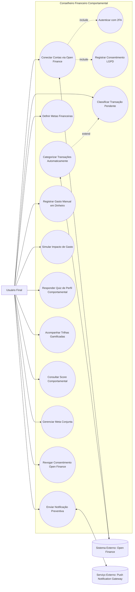

# Semana 2 — Elicitação do Bloco A (Requisitos 01 a 05)

**Período:** 17/08/2026 – 23/08/2026 · **Fase:** 1. Descoberta, Conformidade e Arquitetura
**Fonte do enunciado:** [estudo_caso5.md](../../estudo_caso5.md), seção "Semana 2 (Iteração 2)"
**Equipe:** Brenno (AR1 — specs) · Ian (D1 — jornadas) · Joel & Davi (AR2/D2 — mapeamento prévio do Bloco B)

## Status dos entregáveis

| # | Entregável | Status | Observação |
| --- | --- | --- | --- |
| 1 | Especificação BDD/Gherkin US-01 a US-05 | Feito | Seção 1. |
| 2 | Especificação do Gatilho Antigasto (RN02) e Registro Manual <3 Clics (RF05) | Feito | Seção 2. |
| 3 | Regra de Congelamento por Revogação (RN01) e Limbo "A Classificar" (RN04) | Feito | Seção 3. |
| 4 | Diagrama de Casos de Uso (entrega oficial desta semana, conforme [diagramasUML.md](../../diagramasUML.md)) | Feito | Seção 4. |
| 5 | Mapeamento prévio do Bloco B + desenho de personas | Adiantado para Semana 3 | Ver [../semana-03](../semana-03/README.md) — decisão de manter junto ao restante do Bloco B para evitar duplicidade. |

---

## 1. User Stories US-01 a US-05 (BDD/Gherkin)

### US-01 — Conexão via Open Finance (RF01)
**Como** usuário do aplicativo **quero** conectar minhas contas bancárias via Open Finance **para que** o app monitore meus gastos automaticamente.

```gherkin
Funcionalidade: Conexão de contas via Open Finance

  Cenário: Conectar conta bancária com sucesso
    Dado que estou autenticado no aplicativo com 2FA
    E aceitei os termos de consentimento LGPD
    Quando autorizo o acesso via Open Finance ao meu banco
    Então o sistema deve armazenar um token de consentimento sem acessar minha senha bancária
    E o status da minha conexão deve mudar para "Ativo"
```

### US-02 — Categorização automática de transações (RF02)
```gherkin
Funcionalidade: Categorização automática de transações

  Cenário: Transação categorizada automaticamente
    Dado que uma nova transação foi sincronizada via Open Finance
    Quando o motor de classificação processa a transação
    Então ela deve ser categorizada automaticamente com precisão esperada acima de 92%
```

### US-03 — Metas financeiras (RF03)
```gherkin
Funcionalidade: Definição de metas financeiras

  Cenário: Criar meta de longo prazo
    Dado que estou na tela de gestão de metas
    Quando crio uma meta de longo prazo com valor alvo e prazo
    Então a meta deve ser exibida no painel com o progresso calculado a partir do saldo disponível
```

### US-04 — Notificação preventiva (RF04)
```gherkin
Funcionalidade: Notificação preventiva antidesperdício

  Cenário: Notificação enviada 1h antes do horário habitual (RN02)
    Dado que o sistema mapeou que costumo comprar delivery às sextas-feiras às 20h
    Quando chega sexta-feira às 19h
    Então devo receber uma notificação preventiva amigável sobre o gasto habitual
```

### US-05 — Registro manual em dinheiro (RF05)
```gherkin
Funcionalidade: Registro manual rápido de gastos

  Cenário: Registrar gasto em dinheiro em até 3 toques
    Dado que estou na tela inicial do aplicativo
    Quando toco no atalho de registro rápido, informo o valor e confirmo
    Então o gasto deve ser salvo utilizando no máximo 3 toques na tela
```

---

## 2. Especificação: Gatilho Antigasto (RN02) e Registro Manual (RF05)

* **RN02 — Gatilho Antigasto:** o envio da notificação preventiva deve ocorrer **exatamente 1 hora antes** do horário habitual mapeado de consumo do usuário. Exemplo: hábito de pedir delivery às sextas 20h → notificação enviada às sextas 19h.
  * Pré-condição: o Detector de Padrão de Impulso (ver [../semana-04](../semana-04/README.md)) precisa ter identificado pelo menos N ocorrências recorrentes do mesmo dia/horário/categoria antes de agendar o gatilho.
  * <!-- ATENÇÃO: o valor de N (nº mínimo de ocorrências para considerar "recorrente") não está definido em README.md — decisão de produto pendente da equipe, ver BACKLOG.md. -->
* **RF05 — Registro manual em <3 cliques:** fluxo alvo: (1) toque no atalho de registro rápido na tela inicial → (2) campo de valor já em foco, teclado numérico aberto automaticamente → (3) toque em "Confirmar". Três toques no total, sem etapas intermediárias de categoria obrigatória (categoria pode ser default "Dinheiro/Outros" e reclassificada depois).

## 3. Especificação: Congelamento por Revogação (RN01) e Limbo "A Classificar" (RN04)

* **RN01:** ao revogar o consentimento Open Finance, o sistema deve **congelar imediatamente** as análises preditivas (score, simuladores, gatilhos). Dados antigos continuam visíveis por até 30 dias corridos; após esse prazo sem o acesso ser restabelecido, os dados antigos são ocultados da interface principal (não excluídos do banco, apenas ocultos — retenção segue política de dados a definir).
* **RN04:** transações sem dados suficientes do estabelecimento entram no estado `AClassificar`. Enquanto houver ao menos uma transação nesse estado na semana corrente, o cálculo do Score Comportamental fica **suspenso** (não é calculado com valor parcial/zerado — fica com status "Suspenso" visível ao usuário, não "0 pontos").

Ambas as regras estão modeladas formalmente no Modelo de Domínio (ver [../semana-07/modelo-dominio.md](../semana-07/modelo-dominio.md), agregados `ConexaoOpenFinance` e `PerfilUsuario`).

## 4. Diagrama de Casos de Uso



> Nota de notação: Mermaid não tem um tipo nativo de Diagrama de Casos de Uso; a representação acima é uma aproximação via `flowchart`. Ver observação em [diagramasUML.md](../../diagramasUML.md) e item correspondente em [BACKLOG.md](../../BACKLOG.md) caso a entrega formal exija notação UML estrita (ex. PlantUML).
