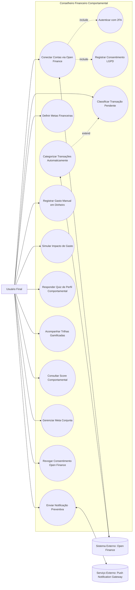

# Diagrama de Casos de Uso

**Semana:** [Semana 2 — Elicitação do Bloco A (Requisitos 01 a 05)](../README.md)
**Responde a:** Entregável 4 do enunciado ([estudo_caso5.md](../../../estudo_caso5.md), seção "Semana 2") — entrega oficial de Diagrama de Casos de Uso conforme [diagramasUML.md](../../../diagramasUML.md) (Fase 1, Semanas 1 a 3)
**Status:** Feito
**Responsável:** Brenno (AR1)

---

> Nota de notação: Mermaid não tem um tipo nativo de Diagrama de Casos de Uso; a representação acima é uma aproximação via `flowchart`. Ver observação em [diagramasUML.md](../../../diagramasUML.md) e item correspondente em [BACKLOG.md](../../../BACKLOG.md) caso a entrega formal exija notação UML estrita (ex. PlantUML).
