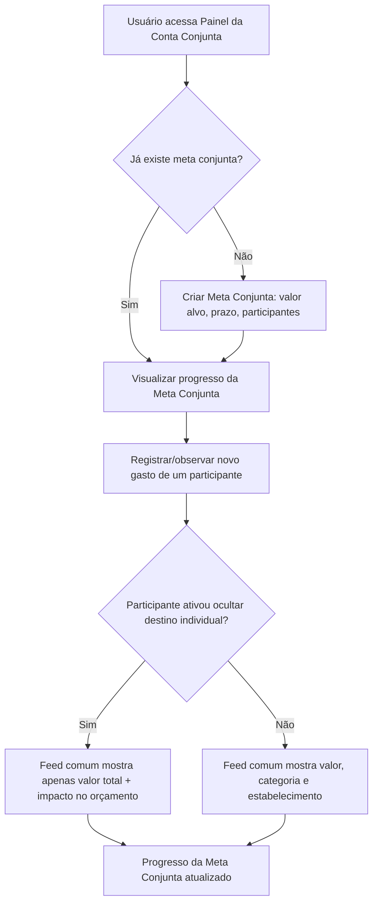
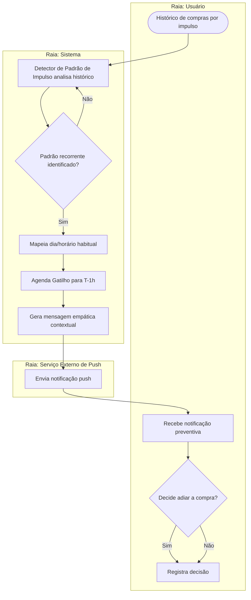

# Semana 3 — Elicitação do Bloco B (Requisitos 06 a 10)

**Período:** 24/08/2026 – 30/08/2026 · **Fase:** 1. Descoberta, Conformidade e Arquitetura
**Fonte do enunciado:** [estudo_caso5.md](../../estudo_caso5.md), seção "Semana 3 (Iteração 3)"
**Equipe:** Joel (AR2 — specs) · Davi (D2 — user flows) · com apoio de Brenno/Ian no mapeamento prévio (transferido da Semana 2)

## Status dos entregáveis

| # | Entregável | Status | Observação |
| --- | --- | --- | --- |
| 1 | Especificação BDD/Gherkin US-06 a US-10 | Feito | Seção 1. |
| 2 | Trava de Margem de Segurança (RN03) e Privacidade do Casal (RN05) | Feito | Seção 2. |
| 3 | Personas (Comprador por Impulso vs. Casal) | Feito | Seção 3. |
| 4 | User Flows de Contas Conjuntas | Feito (rascunho textual) | Seção 4 — fluxo lógico pronto; a versão visual definitiva depende do Figma (ver [BACKLOG.md](../../BACKLOG.md)). |
| 5 | Diagrama de Atividades (entrega oficial desta semana, conforme [diagramasUML.md](../../diagramasUML.md)) | Feito | Seção 5. |

---

## 1. User Stories US-06 a US-10 (BDD/Gherkin)

### US-06 — Simulador de impacto de gasto (RF06)
```gherkin
Funcionalidade: Simulador de impacto de gastos nas metas

  Cenário: Simular impacto de gasto supérfluo em uma meta
    Dado que tenho uma meta "Viagem de Fim de Ano" com um prazo definido
    Quando simulo um gasto de R$ 600 fora do orçamento
    Então o sistema deve exibir o novo prazo estimado para alcançar a meta

  Cenário: Bloquear sugestão de aporte abaixo da reserva mínima (RN03)
    Dado que meu saldo atual é inferior a 1 mês do meu custo de vida básico
    Quando simulo ou consulto uma sugestão de aporte em uma meta de longo prazo
    Então o sistema não deve sugerir investimentos ou aportes
    E deve exibir um aviso explicando a trava de reserva mínima
```

### US-07 — Quiz de perfil comportamental (RF07)
```gherkin
Funcionalidade: Quiz de perfil comportamental de gastos

  Cenário: Concluir quiz e obter perfil
    Dado que respondi todas as perguntas do quiz comportamental
    Quando envio minhas respostas
    Então o sistema deve calcular e exibir meu perfil de gastador
```

### US-08 — Trilhas gamificadas (RF08)
```gherkin
Funcionalidade: Trilhas gamificadas de educação financeira

  Cenário: Receber trilha recomendada após identificar erro de consumo
    Dado que meu perfil comportamental identificou um padrão de compras por impulso
    Quando acesso o hub de trilhas
    Então devo ver uma trilha gamificada recomendada relacionada a esse padrão
```

### US-09 — Score comportamental semanal (RF09)
```gherkin
Funcionalidade: Score de saúde financeira comportamental semanal

  Cenário: Calcular score semanal
    Dado que todas as minhas transações da semana estão classificadas
    Quando o sistema processa o fechamento semanal
    Então uma pontuação de saúde financeira comportamental deve ser calculada e exibida no dashboard

  Cenário: Score não calculado com transações pendentes (RN04)
    Dado que existem transações no limbo "A Classificar" na semana
    Quando o sistema tenta calcular o score semanal
    Então o cálculo deve permanecer suspenso até que todas as transações sejam classificadas
```

### US-10 — Meta conjunta (RF10)
```gherkin
Funcionalidade: Metas conjuntas com privacidade individual

  Cenário: Criar meta conjunta com privacidade individual (RN05)
    Dado que estou vinculado a uma conta conjunta com meu cônjuge
    Quando crio uma meta conjunta e ativo a opção de ocultar o destino de compras individuais
    Então o feed compartilhado deve exibir apenas o valor total debitado e o impacto no orçamento
    E não deve revelar o nome do estabelecimento da compra individual
```

---

## 2. Especificação: Margem de Segurança (RN03) e Privacidade do Casal (RN05)

* **RN03:** o sistema não sugere investimentos/aportes em metas de longo prazo se o saldo atual (conta corrente + poupança) for inferior ao equivalente a 1 mês do custo de vida básico do usuário (a "Reserva Mínima"). Ver Value Object `ReservaMinima` no [Modelo de Domínio](../semana-07/modelo-dominio.md).
  * <!-- ATENÇÃO: "custo de vida básico" precisa de uma fonte de dado — README.md não especifica se é autodeclarado pelo usuário no onboarding ou inferido do histórico de gastos essenciais. Decisão de produto pendente. -->
* **RN05:** em contas conjuntas, usuários podem optar por ocultar o destino detalhado de compras individuais; o feed comum mostra apenas valor total debitado e impacto no orçamento geral. O toggle de privacidade é por usuário, não por conta (cada participante decide sobre suas próprias compras).

## 3. Personas

> Rascunho para validação da equipe antes da Semana 12 (testes de usabilidade).

### Persona A — "Comprador por Impulso"
* **Perfil:** jovem adulto, renda formalizada, usa apps de delivery e assinaturas com frequência.
* **Dor:** percebe o dinheiro sumindo sem entender o padrão; sente culpa após gastos por impulso.
* **Necessidade:** ser avisado *antes* do gasto, sem julgamento moral (RN02, RF04, RF07).
* **Cenário de uso:** recebe o Gatilho Antigasto às sextas 19h, antes do pedido habitual de delivery às 20h.

### Persona B — "Casal Dividindo Orçamento"
* **Perfil:** casal com conta conjunta, um dos dois mais conservador financeiramente.
* **Dor:** falta de transparência no orçamento comum sem expor decisões individuais de consumo.
* **Necessidade:** visibilidade do impacto total no orçamento sem detalhar compras individuais (RN05, RF10).

## 4. User Flow — Meta Conjunta e Privacidade (RF10, RN05)



## 5. Diagrama de Atividades — Gatilho Antigasto (RN02)


