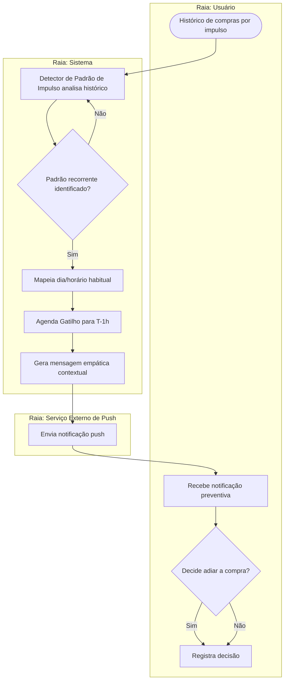

# Diagrama de Atividades — Gatilho Antigasto (RN02)

**Semana:** [Semana 3 — Elicitação do Bloco B (Requisitos 06 a 10)](../README.md)
**Responde a:** Entregável 4 do enunciado ([estudo_caso5.md](../../../estudo_caso5.md), seção "Semana 3") — entrega oficial de Diagrama de Atividades conforme [diagramasUML.md](../../../diagramasUML.md) (Fase 1, Semanas 1 a 3)
**Status:** Feito
**Responsável:** Davi (D2)

---

