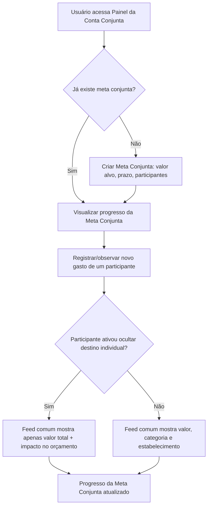

# Personas e User Flows de Contas Conjuntas

**Semana:** [Semana 3 — Elicitação do Bloco B (Requisitos 06 a 10)](../README.md)
**Responde a:** Entregável 3 do enunciado ([estudo_caso5.md](../../../estudo_caso5.md), seção "Semana 3") — *"Personas (Comprador por Impulso vs. Casal) e User Flows de Contas Conjuntas"*
**Status:** Feito (rascunho textual) — fluxo lógico pronto; a versão visual definitiva depende do Figma (ver [BACKLOG.md](../../../BACKLOG.md))
**Responsável:** Davi (D2)

---

## 1. Personas

> Rascunho para validação da equipe antes da [Semana 12](../../semana-12/README.md) (testes de usabilidade).

### Persona A — "Comprador por Impulso"
* **Perfil:** jovem adulto, renda formalizada, usa apps de delivery e assinaturas com frequência.
* **Dor:** percebe o dinheiro sumindo sem entender o padrão; sente culpa após gastos por impulso.
* **Necessidade:** ser avisado *antes* do gasto, sem julgamento moral (RN02, RF04, RF07).
* **Cenário de uso:** recebe o Gatilho Antigasto às sextas 19h, antes do pedido habitual de delivery às 20h.

### Persona B — "Casal Dividindo Orçamento"
* **Perfil:** casal com conta conjunta, um dos dois mais conservador financeiramente.
* **Dor:** falta de transparência no orçamento comum sem expor decisões individuais de consumo.
* **Necessidade:** visibilidade do impacto total no orçamento sem detalhar compras individuais (RN05, RF10).

## 2. User Flow — Meta Conjunta e Privacidade (RF10, RN05)

