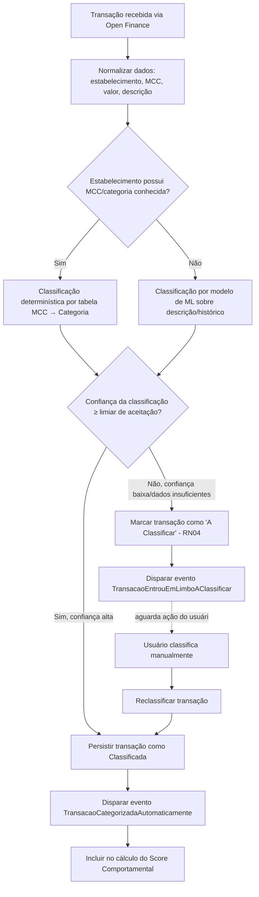

# Semana 4 — Wireframes em Baixa Fidelidade (Lo-Fi)

**Período:** 31/08/2026 – 06/09/2026 (semana atual) · **Fase:** 2. Prototipagem Lo-Fi/Mid-Fi e Design System
**Fonte do enunciado:** [estudo_caso5.md](../../estudo_caso5.md), seção "Semana 4 (Iteração 4)"
**Equipe:** Brenno & Joel (AR1/AR2 — fluxogramas do algoritmo) · Ian & Davi (D1/D2 — wireframes)

## Status dos entregáveis

| # | Entregável | Status | Observação |
| --- | --- | --- | --- |
| 1 | Fluxogramas do Motor de Classificação de Transações por IA (RNF-08, precisão >92%) | Feito | Seção 1. |
| 2 | Wireframes Lo-Fi do Dashboard, Seletor de Metas e Quiz Comportamental | Não iniciado | Requer Figma/ferramenta de design — fora do escopo desta preparação. Ver [BACKLOG.md](../../BACKLOG.md). |
| 3 | Diagrama de Sequência | Em elaboração | Entrega oficial na Semana 5 (janela "Semanas 4 e 5" em [diagramasUML.md](../../diagramasUML.md)) — ver [../semana-05](../semana-05/README.md). |

---

## 1. Fluxograma do Motor de Classificação de Transações (RNF-08)

Lógica proposta para atingir >92% de precisão sem intervenção do usuário (RNF-08), com fallback explícito para o limbo "A Classificar" (RN04) em vez de forçar uma categoria de baixa confiança:

<!-- ATENÇÃO: o valor exato do "limiar de aceitação" de confiança, o modelo de ML a usar e a fonte da tabela MCC→Categoria são decisões técnicas/de produto que a equipe ainda precisa definir e documentar (ex: ADR). RNF-08 exige >92% de precisão *agregada*, não necessariamente por transação individual — a métrica de avaliação (accuracy, precision, recall por categoria) também precisa ser definida antes da implementação real. -->

### Critério de aceite (RNF-08)
* Precisão agregada da classificação automática ≥ 92%, medida sobre uma amostra de validação rotulada manualmente.
* Toda transação com confiança abaixo do limiar vai para "A Classificar" — nunca é categorizada "no chute" (evita poluir o Score Comportamental com dados errados).

## 2. Wireframes Lo-Fi — pendente

Este item depende de ferramenta de design (Figma) e não foi produzido nesta preparação, conforme decisão da equipe de focar em conteúdo textual/técnico nesta rodada. Ver detalhamento em [BACKLOG.md](../../BACKLOG.md), seção "Semana 4".
