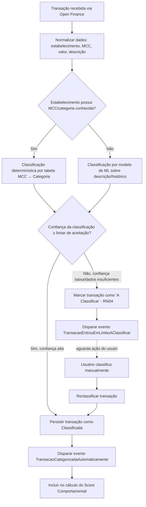

# Fluxograma do Motor de Classificação de Transações (RNF-08)

**Semana:** [Semana 4 — Wireframes em Baixa Fidelidade (Lo-Fi)](../README.md)
**Responde a:** Entregável 1 do enunciado ([estudo_caso5.md](../../../estudo_caso5.md), seção "Semana 4") — *"Fluxogramas do Motor de Classificação de Transações por IA (Precisão >92% - RNF-08)"*
**Status:** Feito
**Responsável:** Brenno & Joel (AR1/AR2)

---

Lógica proposta para atingir >92% de precisão sem intervenção do usuário (RNF-08), com fallback explícito para o limbo "A Classificar" (RN04) em vez de forçar uma categoria de baixa confiança:

> **Pendência:** o valor exato do "limiar de aceitação" de confiança, o modelo de ML a usar e a fonte da tabela MCC→Categoria são decisões técnicas/de produto que a equipe ainda precisa definir e documentar (ex: ADR). RNF-08 exige >92% de precisão *agregada*, não necessariamente por transação individual — a métrica de avaliação (accuracy, precision, recall por categoria) também precisa ser definida antes da implementação real.

### Critério de aceite (RNF-08)
* Precisão agregada da classificação automática ≥ 92%, medida sobre uma amostra de validação rotulada manualmente.
* Toda transação com confiança abaixo do limiar vai para "A Classificar" — nunca é categorizada "no chute" (evita poluir o Score Comportamental com dados errados).
