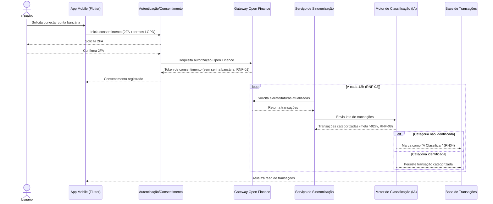
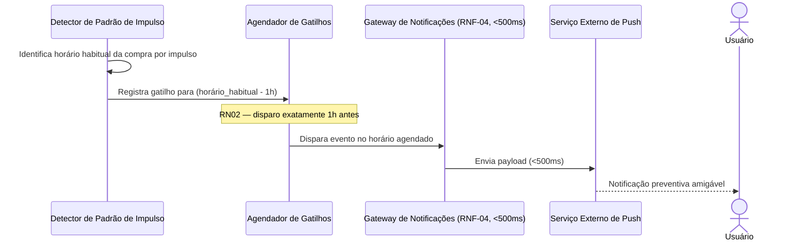

# Semana 5 — Wireframes de Média Fidelidade (Mid-Fi)

**Período:** 07/09/2026 – 13/09/2026 · **Fase:** 2. Prototipagem Lo-Fi/Mid-Fi e Design System
**Fonte do enunciado:** [estudo_caso5.md](../../estudo_caso5.md), seção "Semana 5 (Iteração 5)"
**Equipe:** Brenno & Joel (AR1/AR2 — validação RN05) · Ian & Davi (D1/D2 — wireframes)

## Status dos entregáveis

| # | Entregável | Status | Observação |
| --- | --- | --- | --- |
| 1 | Wireframes Mid-Fi do Simulador de Impacto e Feed do Casal | Não iniciado | Requer Figma — ver [BACKLOG.md](../../BACKLOG.md). |
| 2 | Protótipo Mid-Fi do Painel do Limbo "A Classificar" (RN04) | Não iniciado | Requer Figma — ver [BACKLOG.md](../../BACKLOG.md). |
| 3 | Diagrama de Sequência (entrega oficial desta semana) | Feito | Seção 1. |
| 4 | Diagrama de Máquina de Estados | Em elaboração | Entrega oficial na Semana 6 (janela "Semanas 5 e 6") — ver [../semana-06](../semana-06/README.md). |

---

## 1. Diagrama de Sequência

### 1.1 Conexão Open Finance, sincronização e categorização

### 1.2 Disparo do Gatilho Antigasto (RN02)

## 2. Wireframes Mid-Fi — pendente

Dependem de Figma/ferramenta de design; não produzidos nesta preparação (ver [BACKLOG.md](../../BACKLOG.md), seção "Semana 5"). O conteúdo lógico dessas telas já está coberto textualmente:
* Simulador de impacto → especificado em [../semana-03](../semana-03/README.md) (US-06) e no Modelo de Domínio ([../semana-07/modelo-dominio.md](../semana-07/modelo-dominio.md), serviço `CalculadoraDeImpactoDeMeta`).
* Painel do limbo "A Classificar" → especificado em [../semana-02](../semana-02/README.md), seção 3 (RN04).
