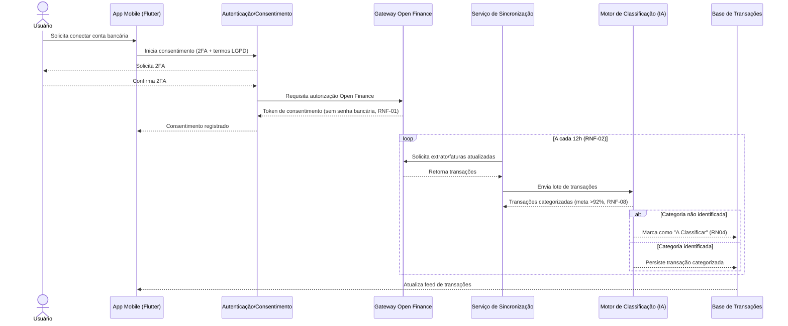
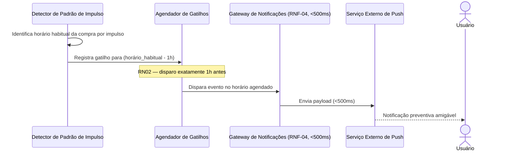

# Diagrama de Sequência

**Semana:** [Semana 5 — Wireframes de Média Fidelidade (Mid-Fi)](../README.md)
**Responde a:** entrega oficial de Diagrama de Sequência conforme [diagramasUML.md](../../../diagramasUML.md) (Fase 2, "Entrega: Semanas 4 e 5")
**Status:** Feito
**Responsável:** Brenno & Joel (AR1/AR2)

---

## 1. Conexão Open Finance, sincronização e categorização

## 2. Disparo do Gatilho Antigasto (RN02)

