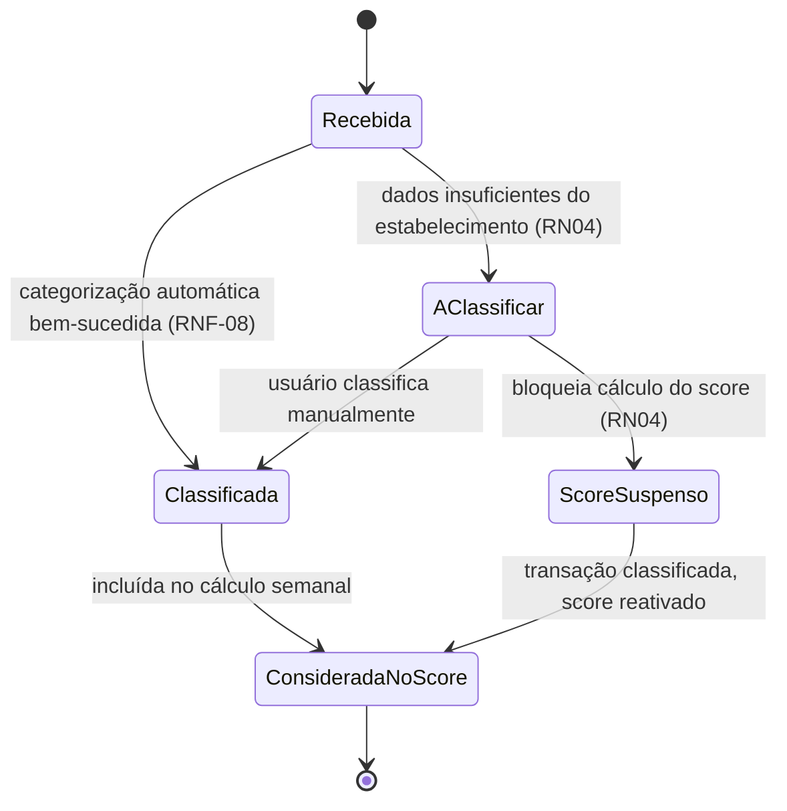
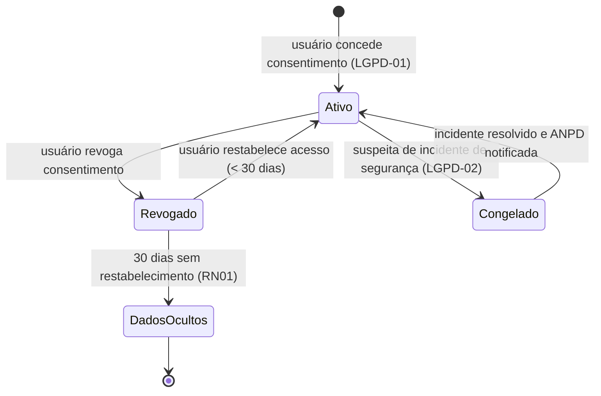

# Semana 6 — Design System "Mindful Finance UX"

**Período:** 14/09/2026 – 20/09/2026 · **Fase:** 2. Prototipagem Lo-Fi/Mid-Fi e Design System
**Fonte do enunciado:** [estudo_caso5.md](../../estudo_caso5.md), seção "Semana 6 (Iteração 6)"
**Equipe:** Brenno & Joel (AR1/AR2 — dicionário de categorias) · Ian & Davi (D1/D2 — design tokens)

## Status dos entregáveis

| # | Entregável | Status | Observação |
| --- | --- | --- | --- |
| 1 | Design System "Mindful Finance UX" compatível com Flutter a 60 FPS (RNF-03) | Parcial | Especificação de tokens (texto) pronta na seção 2; componentes visuais reais (Figma/código Flutter) ficam pendentes — ver [BACKLOG.md](../../BACKLOG.md). |
| 2 | Dicionário de Categorização Orçamentária e Mensagens Empáticas de Push | Feito | Seção 1. |
| 3 | Diagrama de Máquina de Estados (entrega oficial desta semana) | Feito | Seção 3. |
| 4 | Diagrama de Classes de Domínio | Em elaboração | Entrega oficial na Semana 7 — ver [../semana-07](../semana-07/README.md). |

---

## 1. Dicionário de Categorização Orçamentária e Mensagens Empáticas de Push

### 1.1 Categorias de gasto (base para o Motor de Classificação, RF02/RNF-08)

| Categoria | Exemplos de Estabelecimento/MCC | Observação |
| --- | --- | --- |
| Alimentação — Delivery | iFood, Rappi, Uber Eats | Categoria de maior atenção para Gatilho Antigasto (RN02). |
| Alimentação — Mercado | Supermercados, hortifrúti | Gasto essencial, não gera gatilho de impulso. |
| Transporte | Uber, 99, combustível | — |
| Lazer/Assinaturas | Streaming, apps de jogos | Candidato a compra por impulso recorrente. |
| Moradia | Aluguel, condomínio, contas | Gasto essencial fixo — usado no cálculo de custo de vida básico (RN03). |
| Saúde | Farmácias, planos de saúde | — |
| Compras — Vestuário/Eletrônicos | Lojas de roupa, e-commerce | Candidato a compra por impulso pontual (ex.: tênis de R$600 do cenário de teste). |
| A Classificar | — | Estado transitório (RN04), não é uma categoria de negócio, é um status. |

<!-- ATENÇÃO: lista de categorias é um rascunho inicial baseado nos exemplos do README.md e estudo_caso5.md; a lista final e o mapeamento MCC→Categoria completo dependem de dados reais do provedor Open Finance escolhido. -->

### 1.2 Mensagens Empáticas de Push (Gatilho Antigasto, RN02)

Princípio: nunca usar tom de julgamento moral (confirmado como critério de aceite no roteiro de testes de usabilidade, Semana 12).

* "Ei! Notamos que às sextas à noite o delivery costuma aparecer por aqui 🍕. Sem pressão — só um lembrete de que sua meta [Nome da Meta] agradece um dia sem pedido."
* "Reserva para [Nome da Meta] está a X% do objetivo. Se hoje não for o dia do delivery, você chega lá Y dias mais rápido."
* Tom: 2ª pessoa, sem exclamação de alarme, sempre citando o benefício futuro (a meta), nunca o "erro" cometido.

## 2. Design System "Mindful Finance UX" — Especificação de Tokens

> Especificação textual dos tokens visuais, para tradução posterior em Figma/Flutter (`ThemeData`). Compatibilidade com RNF-03 (60 FPS) é responsabilidade da implementação (evitar rebuilds desnecessários, usar `const` widgets), não do valor dos tokens em si.

### 2.1 Cores (com alternativa não-cromática, RNF-10 — ver [../semana-01](../semana-01/README.md))

| Token | Uso | Cor | Ícone/Padrão redundante |
| --- | --- | --- | --- |
| `color.success` | Meta no prazo, saldo positivo | Verde | Seta ↑ |
| `color.warning` | Meta em risco | Laranja | Relógio ⏱ |
| `color.danger` | Bloqueio de aporte (RN03) | Vermelho | Cadeado 🔒 |
| `color.pending` | Transação "A Classificar" (RN04) | Azul/Cinza | Interrogação ❓ |
| `color.notice` | Gatilho Antigasto (RN02) | Roxo/Neutro | Sino 🔔 |

### 2.2 Tipografia
* `type.display` — títulos de dashboard e score semanal.
* `type.body` — texto padrão (contraste mínimo AA sobre `color.background`).
* `type.caption` — rótulos de acessibilidade que acompanham cor+ícone (nunca omitir).

### 2.3 Componentes previstos
* `CardMeta` (estados: no prazo / atrasada / concluída)
* `BadgeStatusTransacao` (Classificada / A Classificar)
* `IndicadorScoreComportamental` (0-100, com faixa de cor + ícone)
* `ModalRegistroRapido` (RF05, otimizado para ≤3 toques)
* `BannerGatilhoAntigasto` (RF04/RN02)

## 3. Diagrama de Máquina de Estados

### 3.1 Ciclo de vida de `Transacao`

### 3.2 Ciclo de vida de `ConsentimentoOpenFinance`

