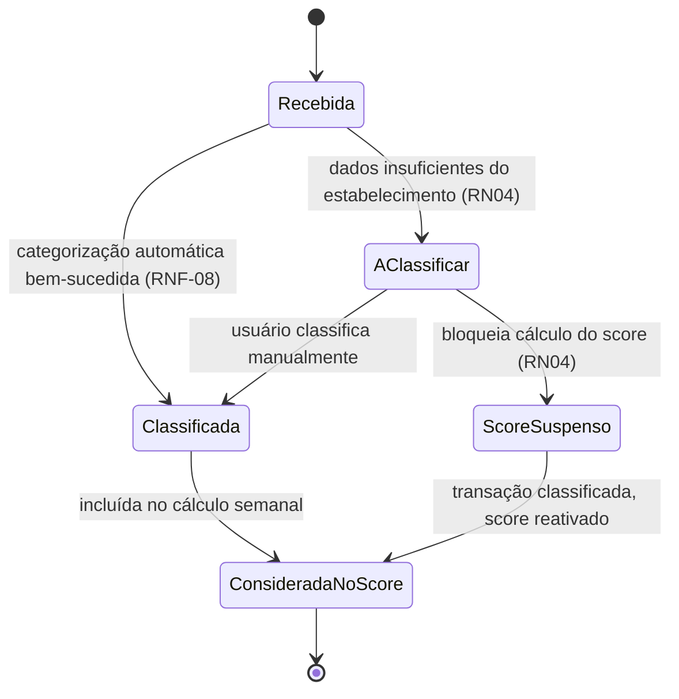
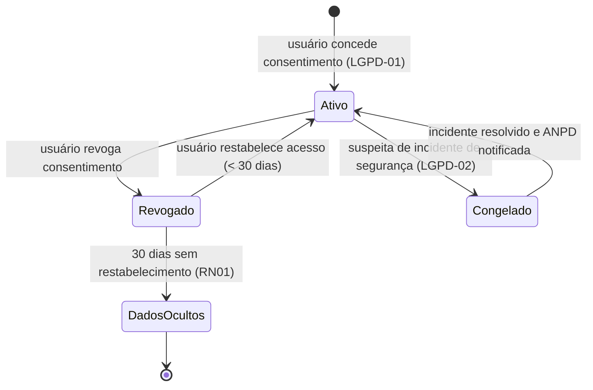

# Diagrama de Máquina de Estados

**Semana:** [Semana 6 — Design System "Mindful Finance UX"](../README.md)
**Responde a:** entrega oficial de Diagrama de Máquina de Estados conforme [diagramasUML.md](../../../diagramasUML.md) (Fase 2, "Entrega: Semanas 5 e 6")
**Status:** Feito
**Responsável:** Brenno & Joel (AR1/AR2)

---

## 1. Ciclo de vida de `Transacao`

## 2. Ciclo de vida de `ConsentimentoOpenFinance`

