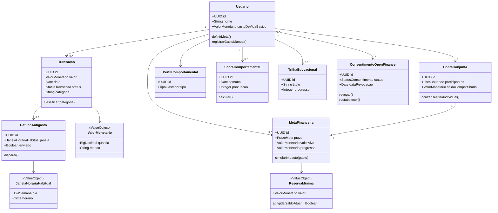
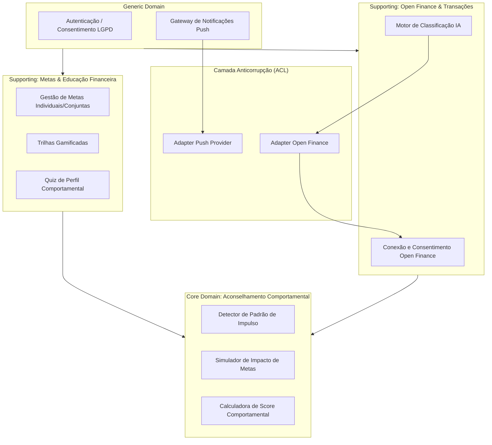

# Semana 7 — Consolidação e Especificação Técnica

**Período:** 21/09/2026 – 27/09/2026 · **Fase:** 2. Prototipagem Lo-Fi/Mid-Fi e Design System
**Fonte do enunciado:** [estudo_caso5.md](../../estudo_caso5.md), seção "Semana 7 (Iteração 7)"
**Equipe:** Brenno & Joel (AR1/AR2 — especificações técnicas) · Ian & Davi (D1/D2 — componentes reutilizáveis)

## Status dos entregáveis

| # | Entregável | Status | Observação |
| --- | --- | --- | --- |
| 1 | Especificação de Sincronização Open Finance 2x/dia (RNF-02) e Criptografia (RNF-09) | Feito | Seção 1. |
| 2 | Componentes UI de Cards de Metas, Indicadores de Score e Alternativas Daltonistas | Feito (especificação) | Já coberto na [Semana 6](../semana-06/README.md), §2.3 — sem duplicar aqui; produção visual real (Figma) fica pendente. |
| 3 | Diagrama de Classes de Domínio (entrega oficial desta semana) | Feito | Ver [modelo-dominio.md](modelo-dominio.md) e diagrama abaixo. |
| 4 | Diagrama de Pacotes/Componentes (entrega oficial desta semana) | Feito | Seção 3. |
| 5 | Modelo de Domínio (DDD) completo, entregável implícito das Semanas 6-7 (template em [template_modelo_dominio.md](../../template_modelo_dominio.md)) | Feito | [modelo-dominio.md](modelo-dominio.md). |

---

## 1. Especificação: Sincronização 2x/dia (RNF-02) e Criptografia por Usuário (RNF-09)

* **RNF-02 — Latência de Sincronização:** a atualização de saldos/transações via Open Finance ocorre em background pelo menos 2 vezes ao dia. Proposta técnica: job agendado a cada 12h (ex.: 06h e 18h) por usuário, com re-tentativa exponencial em caso de falha do provedor Open Finance; sincronização adicional sob demanda quando o usuário abre o app manualmente (pull-to-refresh), sem contar como uma das 2 obrigatórias.
* **RNF-09 — Criptografia:** cada usuário possui uma chave de criptografia exclusiva para cifrar dados confidenciais de transações em repouso (envelope encryption: chave de dados por usuário, cifrada por uma chave mestra gerenciada em KMS). Chaves nunca compartilhadas entre usuários; revogação de acesso (RN01) não implica descarte imediato da chave (dados continuam cifrados e ocultos, não perdidos, dentro da janela de 30 dias).

<!-- ATENÇÃO: escolha do provedor de KMS (AWS KMS, GCP KMS, HashiCorp Vault) e política exata de rotação de chaves são decisões de infraestrutura ainda não tomadas pela equipe. -->

## 2. Diagrama de Classes de Domínio

## 3. Diagrama de Pacotes / Componentes

