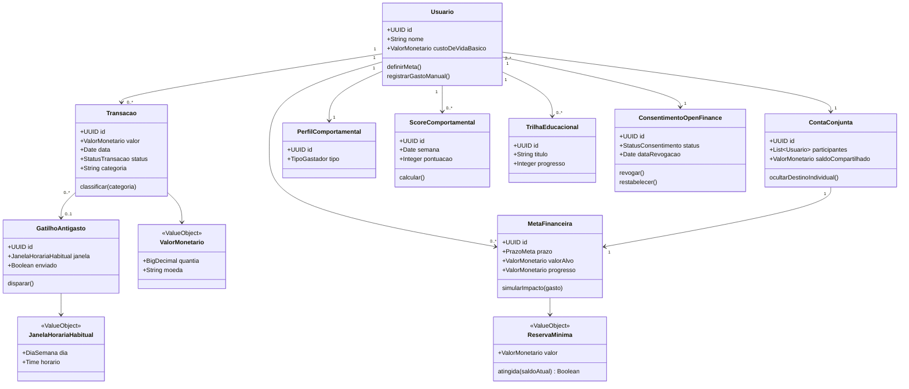

# Diagrama de Classes de Domínio

**Semana:** [Semana 7 — Consolidação e Especificação Técnica](../README.md)
**Responde a:** entrega oficial de Diagrama de Classes de Domínio conforme [diagramasUML.md](../../../diagramasUML.md) (Fase 2, "Entrega: Semanas 6 e 7"); ilustra o [Modelo de Domínio (DDD)](modelo-dominio.md) completo
**Status:** Feito
**Responsável:** Brenno & Joel (AR1/AR2)

---

