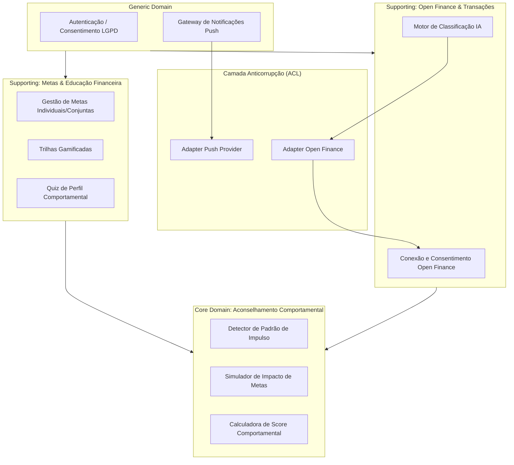

# Diagrama de Pacotes / Componentes

**Semana:** [Semana 7 — Consolidação e Especificação Técnica](../README.md)
**Responde a:** entrega oficial de Diagrama de Pacotes/Componentes conforme [diagramasUML.md](../../../diagramasUML.md) (Fase 2, "Entrega: Semana 7")
**Status:** Feito
**Responsável:** Brenno & Joel (AR1/AR2)

---

