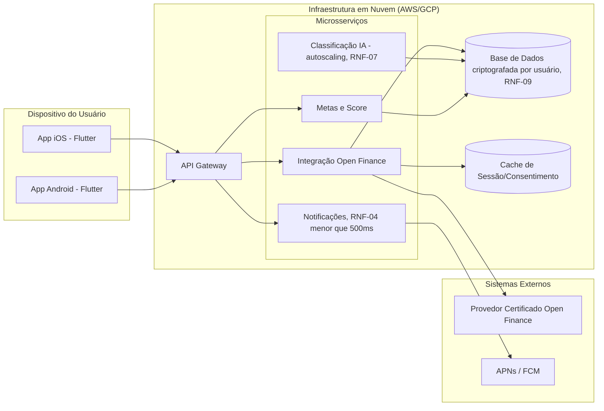

# Semana 11 — Montagem do Protótipo Interativo

**Período:** 19/10/2026 – 25/10/2026 · **Fase:** 3. Design Visual Hi-Fi e Protótipo Navegável
**Fonte do enunciado:** [estudo_caso5.md](../../estudo_caso5.md), seção "Semana 11 (Iteração 11)"
**Equipe:** Brenno & Joel (AR1/AR2 — plano de testes) · Ian & Davi (D1/D2 — protótipo Figma)

## Status dos entregáveis

| # | Entregável | Status | Observação |
| --- | --- | --- | --- |
| 1 | Protótipo Navegável Interativo no Figma | Não iniciado | Requer Figma — ver [BACKLOG.md](../../BACKLOG.md). |
| 2 | Roteiro de Testes de Usabilidade | Feito | Seção 2 — instrumento pronto; a *execução* com participantes reais é a Semana 12. |
| 3 | Diagrama de Implantação (entrega oficial desta semana) | Feito | Seção 1. |

---

## 1. Diagrama de Implantação

<!-- ATENÇÃO: escolha final entre AWS/GCP e topologia exata de rede (VPC, regiões) é decisão de infraestrutura da equipe, não assumida aqui. -->

## 2. Roteiro de Teste de Usabilidade (instrumento para a Semana 12)

### Ficha Técnica
* **Perfil do participante:** pessoas que desejam controlar compras por impulso e casais que gerenciam finanças em conjunto.
* **Papéis:** Brenno ou Joel — Facilitador da sessão · Ian ou Davi — Observador/Anotador de UX.
* **Duração:** 45 minutos por participante.
* **Ambiente:** protótipo interativo no Figma (pendente, item 1) rodando em dispositivo móvel.

### Passos da Sessão
1. **Introdução (5 min):** explicar o propósito do app sem juízo moral sobre gastos; obter aceite verbal para gravação; dados fictícios.
2. **Cenários práticos (30 min):** ver tabela abaixo, sem indicar onde clicar.
3. **Avaliação pós-teste (10 min):** aplicar System Usability Scale (SUS) + perguntas abertas sobre a notificação preventiva e a privacidade de casal.

### Cenários de Teste

| Tarefa | Requisitos/Regras Avaliadas | Instrução ao Usuário | Critério de Aceite |
| --- | --- | --- | --- |
| 01 | REQ-01, REQ-05, RN01 | "Conecte sua conta bancária fictícia via Open Finance e registre um gasto de R$20 em dinheiro em até 3 toques." | Conexão concluída; registro em ≤3 toques. |
| 02 | REQ-02, REQ-04, RN02, RN04 | "É sexta 19h. Observe a notificação preventiva e resolva a transação pendente no limbo 'A Classificar'." | Notificação percebida 1h antes; transação reclassificada e score destravado. |
| 03 | REQ-03, REQ-06, RN03 | "Simule o impacto de uma compra de R$600 na sua meta 'Viagem de Fim de Ano'." | Novo prazo exibido; aviso de reserva mínima se aplicável. |
| 04 | REQ-07, REQ-08, REQ-09 | "Responda ao quiz de perfil e acesse a trilha recomendada." | Perfil calculado; trilha relevante sugerida; score visível. |
| 05 | REQ-10, RN05 | "Ative a privacidade individual na meta conjunta, ocultando o nome da loja de uma compra." | Feed do parceiro mostra só valor/categoria, não a loja. |

> Este roteiro adapta o exemplo em `estudo_caso5.md` §4 como documento próprio do grupo, mantendo os mesmos critérios de aceite (já derivados diretamente dos requisitos do README.md).
