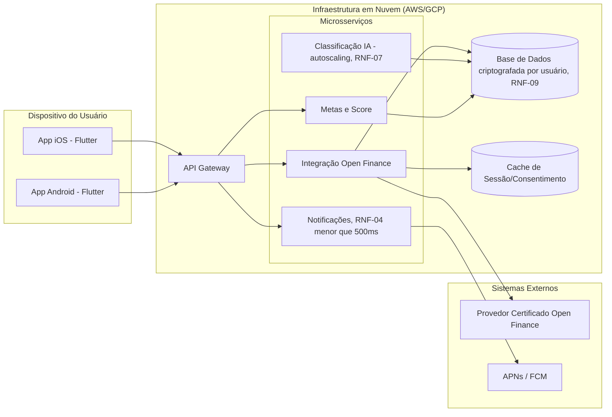

# Diagrama de Implantação

**Semana:** [Semana 11 — Montagem do Protótipo Interativo](../README.md)
**Responde a:** Entregável 3 do enunciado ([estudo_caso5.md](../../../estudo_caso5.md), seção "Semana 11"); entrega oficial conforme [diagramasUML.md](../../../diagramasUML.md) (Fase 3, "Entrega: Semana 11")
**Status:** Feito
**Responsável:** Brenno & Joel (AR1/AR2)

---

> **Pendência:** escolha final entre AWS/GCP e topologia exata de rede (VPC, regiões) é decisão de infraestrutura da equipe, não assumida aqui. Ver [BACKLOG.md](../../../BACKLOG.md).
